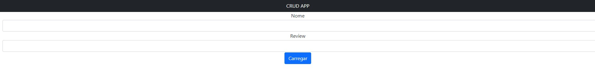
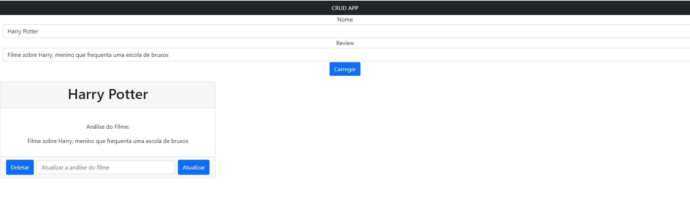

<h1 align="center">CRUD em ReactJS</h1>

<h1 align="center">
    <a href="https://pt-br.reactjs.org/">🔗 React</a>
</h1>
<p align="center">CRUD em ReactJS que busca adicionar, criar, atualizar e deletar filmes e análises</p>

Sumário
=================
<!--ts-->
   * [Sobre](#Sobre)
   * [Pre Requisitos](#pre-requisitos)
   * [Tecnologias](#tecnologias)
   * [Instalação](#instalação)
   * [Como usar](#como-usar)
   * [Devs](#devs)
<!--te-->

<h2 align="center">Sobre</h2>
<p>Projeto realizado com o intuito de iniciar a matéria Banco de Dados, portanto, dentro do projeto assuntos como API, front-end, back-end e banco de dados serão tratados</p>

<h2 align="center">Pre Requisitos</h2>
<p>Para desenvolver o projeto em questão lembre-se de ter em sua máquina, o NodeJS, Visual Studio e de preferência o Git</p>

<h2 align="center">Tecnologias</h2>
<ul>
    <li></li>
    <li></li>
    <li></li>
    <li></li>
    <li></li>
    <li></li>
    <li></li>
    <li></li>
</ul>

<h2 align="center">Instalação</h2>
<p>Para rodar o projeto em sua máquina você irá precisar</p>

```bash
# Clone o projeto com:
$ git clone https://github.com/goldmansenai/crud-react
```

```bash
# Entre no diretório do projeto com: 
$ cd crud-react
```

```bash
# Instale as dependências com:
$ npm install
```

```bash
# Entre na pasta do back-end (server) e rode o servidor com:
$ cd server && npm run devStart
```

```bash
# Saia da pasta server com:
$ cd ..
```

```bash
# Entre na pasta do front-end (client) e rode o projeto com:
$ cd client && npm start
```

<h2 align="center">Como Usar</h2>
<p>Dentro do projeto você verá dois inputs pedindo para informar o nome e a análise do filme, logo em seguida clique no botão "carregar" para adicionar o filme</p>

<p>Para excluir um filme ou atualizar uma análise lembre-se de reiniciar a página para carregar as mudanças</p>


<h2>Devs</h2>
- Camili Martins
- Emelly Costa
- Patricia Rainha
- Thiago Amorim
- Victor Gomes
- Vinícius Sanches
